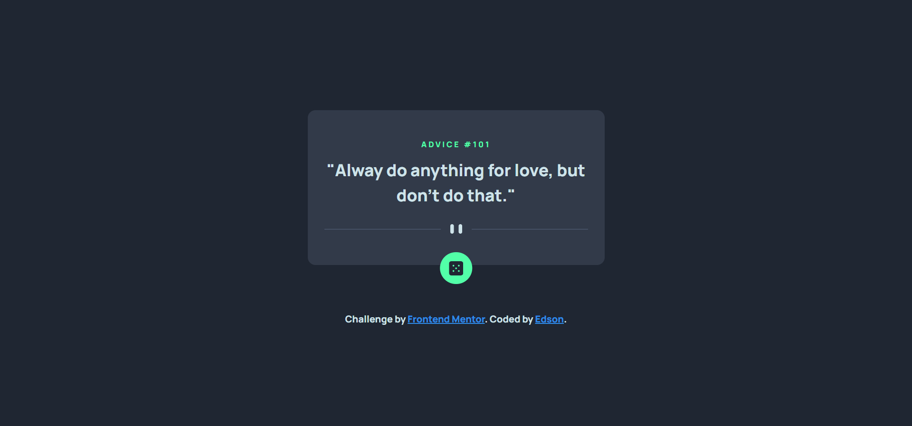

# ✨ Frontend Mentor - Advice generator app solution ✨

Esta é uma solução para o [Advice generator app challenge do Frontend Mentor](https://www.frontendmentor.io/challenges/advice-generator-app-QdUG-13db). Os desafios do Frontend Mentor ajudam-no a melhorar as suas capacidades de codificação através da construção de projectos realistas.

### 🧾 Sobre

Os utilizadores devem ser capazes de:

-   Ver a disposição ideal para a aplicação dependendo do tamanho do ecrã do seu dispositivo
-   Ver os estados de hover para todos os elementos interactivos na página
-   Gerar um novo conselho, clicando no ícone do dado

### Screenshot



### 🚀 Tecnologias utilizadas

-   Semantic HTML5 markup
-   CSS custom properties
-   Flexbox
-   Desktop-first workflow

### 📖 O que eu aprendi

Durante o desenvolvimento desse projeto, aprendi a usar o novo Error.prototype.cause property no Javascript com o propósito de tornar o código mais elegante.

```js
const res = await fetch(...)
if (!res.ok) {
  throw new Error('...', { cause: res })
}

...

catch (err) {
  if (err.cause.status === ...) {
     // Lidar com cada status
  }
}
```

### 👨‍💻 Desenvolvimento contínuo

Pretendo utilizar o novo Error.prototype.cause property no JS, pois a propriedade cause indica a causa original de um erro.

### 🤝 Recursos úteis

-   [API Fetch](https://twitter.com/Steve8708/status/1611437686958739456) e [API Fetch 2](https://twitter.com/Steve8708/status/1611757223008665600) - Uma nova forma de tornar fetch() mais elegante é usar o novo Error.prototype.cause property no JS.

### 〽️ Getting started

```zsh
    # Clonando o repositório em sua máquina
    $ git clone https://github.com/edsonjaguiar/Advice-generator-app
```
